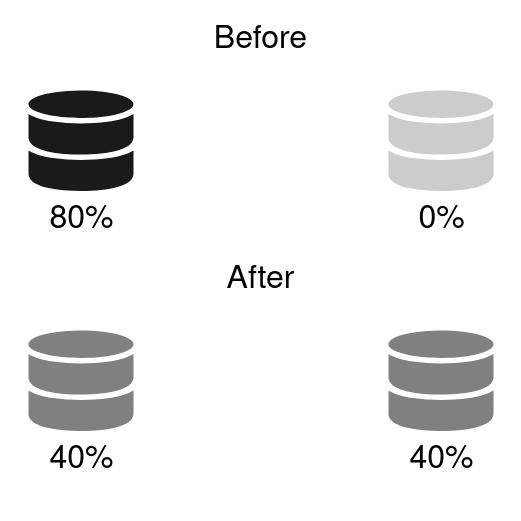

# MySQL Sharding System



# Startup Node(MySQL) Container

required:

* docker

* NODE Environment variable(node name used in docker)

* PORT Environment variable(node port used in docker)

for example.

```

cd node
export NODE=node1 PORT=13306

./build.sh && ./run.sh

```

completed mysql container.

# Required Docker container

* mysql:8.0
