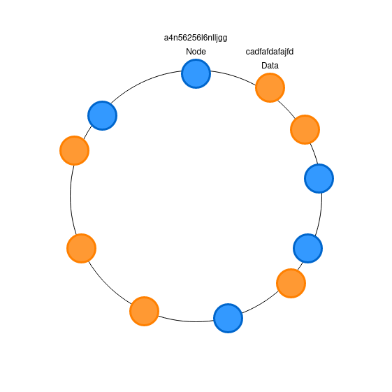
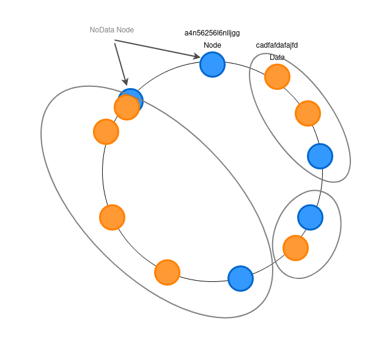

# Sharding Algorithms

there are a way to decide node that be saved data.

* range

* modulo

* consistent hash


## Range

ex. 

user id 0 ~ 1000 => A node
user id 1000 ~ 2000 => B node

demerit:

can't consider access bias. if a lot amous user in A node, access ratio may be 9:1(A:B).　So, the effect of sharding dimin...

## Module

make sharding key, the remainder of dividing the key by the number of nodes.

```

(Sharding Key) mod (Sharding Nodes Number + 1) = Sharding Node

in Python:

ip_lists = list() # ip list of nodes

node_index = debiascii.crc32("sharding key".encode('utf-8')) %  len(ip_lists)

node_ip = ip_lists[node_index]


```

## Consistent Hash

Hash table algorithm developed to determine where to store distributed databases.

required:

 * hash function with comparable output values.
 
 * data



1. Hava value of all nodes and data.(NodeID,DataID)
2. If DataID = NodeID, send Node of NodeID
3. The node with the smallest hash value among the nodes with a hash value larger than the DataID
4. The node with the smallest hash value.


